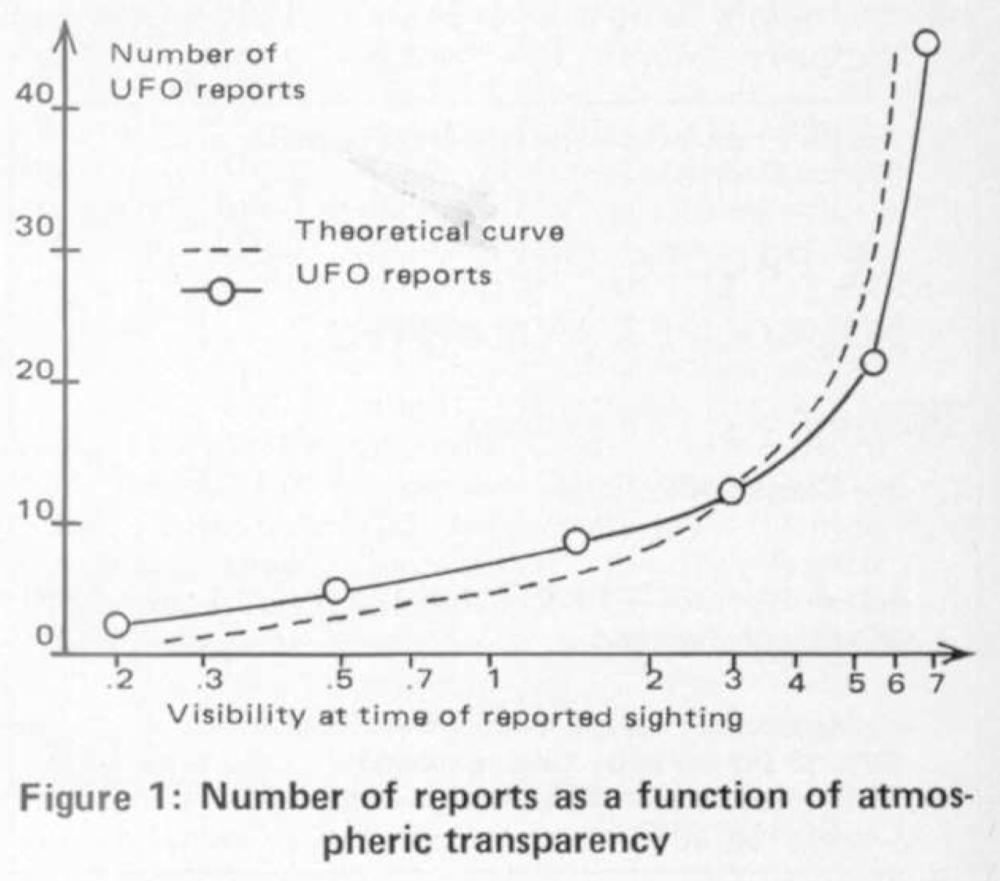
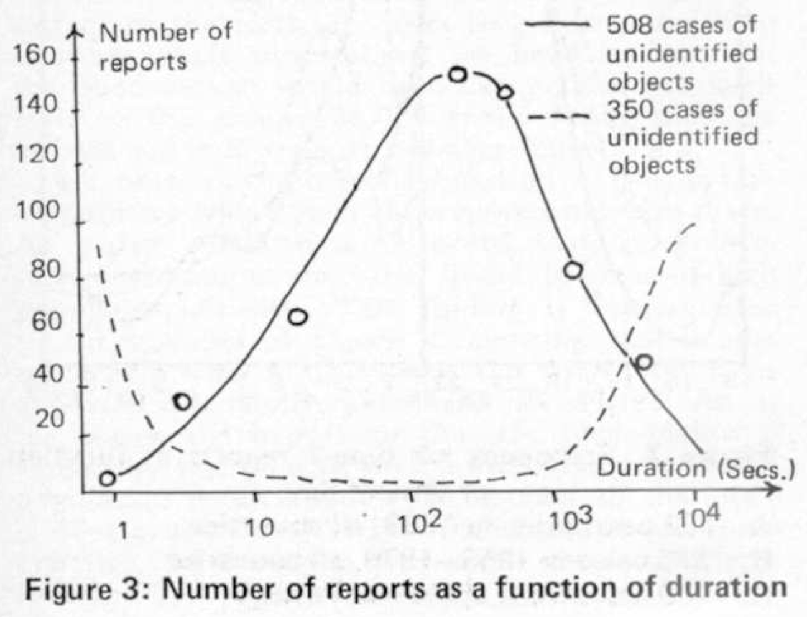
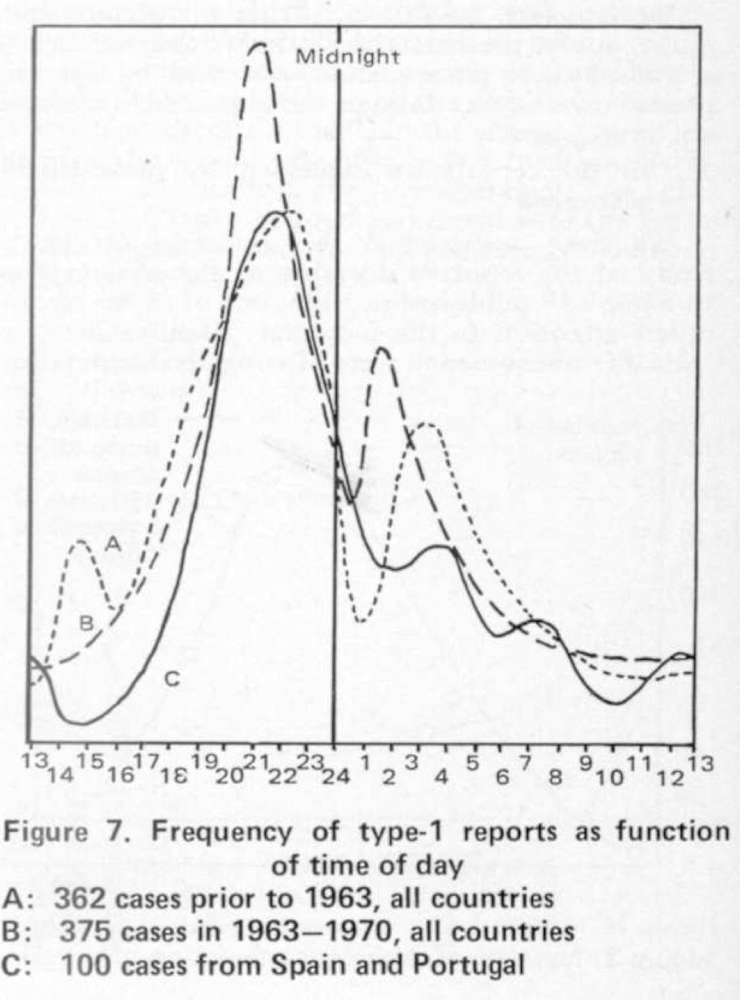
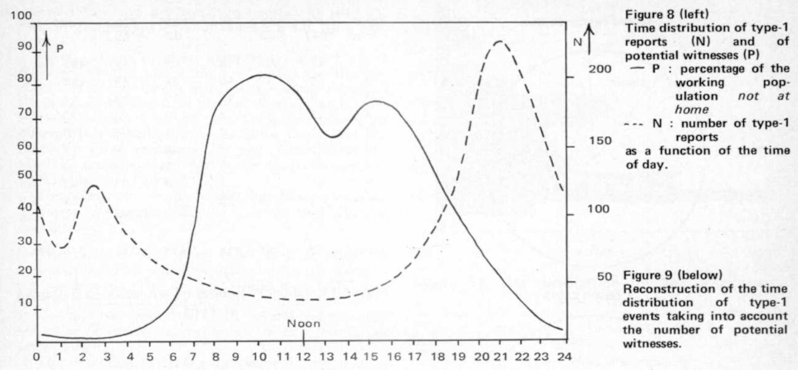

```{r setup, include=FALSE}
knitr::opts_chunk$set(echo=FALSE, warning=FALSE, message=FALSE)
options(scipen=999)

# setwd('~/nuforc_stats/notebooks/')

library(dplyr)
library(ggplot2)
library(knitr)
library(lubridate)
library(stringr)

# load
df <- readRDS('../data/nuforc/processed/nuforc_reports.rds') %>%
  mutate(loc = tolower(paste(city, state, sep=', ')))

weather <- read.csv('../data/weather/processed/weather.tsv', stringsAsFactors=FALSE, sep='\t') %>%
  mutate(datetime = ymd(datetime),
         loc = tolower(loc)) %>%
  inner_join(df, by=c('loc'='loc', 'datetime'='date'))

# elevation <- read.csv('../data/elevation.csv', stringsAsFactors=FALSE) 
```

# Introduction

In 1975, computer scientist Jacques Valleé and his colleague Claude Poher presented a conference paper on the results of applying computational statistics to a database of UFO observations. They ...

They investigate: 

1. Have the witnesses really seen something?
2. Can the reports be explained by identifiable phenomena?
3. Under what conditions is the phenomenon encountered at close range?
4. What are the numbers and the ages of witnesses?
5. Can the observations be correlated with measurable physical events?

There data set consisted of a set of sightings from France dating to X, and a set of set of sightings from outside of France. 

This work attempts to replicate Vallee and Poher's findings, using a data set of sightings from the continental United States in the twenty-first century. Most of the original figures are able to be replicated. Weather data was retrieved from...


# Dataset

- Weather


# Have the witnesses really seen something?

Weather conditions at time of observation is the first question the authors tackle. It is reasonable to assume that if observers really are seeing something, we should see more sightings when the skyer is clearer versus when it is not.

Vallee and Poher use an astronomer's measure, _atmospheric transparency_, as a way to quantify conditions. When clouds, haze, fog, etc., are present in the atmosphere, atmospheric transparency decreases, making it harder to see objects especially from further away. The telescope company Celestron provides a [short explanation]((https://www.cleardarksky.com/csk/)) of atmospheric transparency.

While there are resources for amateur astronomers that [forecast atmospheric transparency](https://www.cleardarksky.com/csk/) over a wide area, the data is not easily accessible, especially decades back and over a many geographies. Instead, I will focus on _visibility_, in the same sense as often given by standard weather reports:

> the greatest distance at which a black object of suitable dimensions, situated near the ground, can be seen and recognized when observed against a bright background. (International Civil Aviation Organization, [via Wikipedia](Meteorological Service for International Air Navigation))

In the figure below, the left plot is from Vallee and Poher, showing the relationship the number of sightings by atmospheric transparency. My own, on the right, plots the same but for transparency. 

```{r, fig.show="hold", out.width="50%"}


weather %>%
  mutate(visibility = if_else(visibility > 9.9, 9.9, visibility)) %>%
  ggplot(aes(x=visibility)) +
    geom_density(aes(y = ..count.. / 10^3)) +
    ylab('Reports (thousands)') +
    theme_light()
```

(Note that I have capped all visibility greater than 10 as 10.)

The two plots support approximately the same conclusion: Sightings are much more likely in very good conditions than in poor atmospheric conditions.

However, Vallee and Poher's curve is not so sharp as mine, and I am unsure what the 'theoretical curve' refers to. The authors remark only that the empirical curve is consistent with 'the model of the human vision for equidistributed luminous objects in the atmosphere.'

The authors also evaluate number of reports as a function of the angular elevation of the UAP relative to the observer. Unfortunately, this variable was not clearly broken out in my own data.


# Can the reports be explained by identifiable phenomena?

In this section, the authors examine the duration of sightings, and the observer's reported distance from the object. Together with visibility, Vallee and Poher are able to compare the characteristics of the average UAP with the characteristics of known objects like balloons, planes, etc. They determine that UAP do not match the characteristics of more recognizable phenomena. A reasonable person may conclude that this rules out manmade objects, meteors, etc., for many UAP reports.

Observer distance from the object is not easily available in the gathered data set, so I will focus on duration of sighting only.

The NUFORC dataset has about 63 thousand cases that contain clear description of the duration. An attempt was made to standardize the durations ('5 minutes', '30-40 minutes', 'an hour') into seconds using regular expressions. Like the original plot, the distribution is log transformed, but the x-axis has been back-transformed to the linear scale.

```{r, fig.show="hold", out.width="50%"}


df %>%
  filter(!is.na(duration_sec),
         duration_sec < 999999) %>%
  ggplot(aes(x=duration_sec)) +
    geom_density(aes(y = ..count.. / 10^3), bw=.4) +
    scale_x_continuous(trans='log', breaks=c(10, 100, 1000, 10000)) +
    ylab('Reports (thousands)') +
    xlab('Duration (in seconds)') +
    theme_light()
```

It is clear there is good agreement between the unbroken black line on the left and my plot on the right. Both distributions are approximately normal, although mine has a 'hump' on the left, indicating more observations in the ~10 second range than expected assuming normality. The median of the NUFORC data is 180 seconds, which appears to be just slightly higher than the median of Vallee and Poher's plot, somewhere just north of 100 seconds. (Although it is hard to expect exactness in an old-fashioned plot like this!)

Vallee and Poher have included a second, broken line on their plot. The 350 cases actually refers to _identified_ objects (despite the typo in the legend). There is thus an immense difference between unidentified and identified cases. The identified cases tend to be observed for less than 10 seconds, or greater than 1000 seconds, but only rarely in between. In contrast, UAP are recorded of having a distance in between.

This difference, along with that of distance and visibility, lead the author to conclude UAP cannot broadly be dismissed as normal sky objects (meteor, jet, etc.).


# Under what conditions is the phenomena encountered at close range?

The distribution of sightings by time of day is reportedly very stable. The authors' plot is below, to the left, using several data sets over several times. My own is to the right. All the densities are approximately the same, peaking around 9 p.m. 

```{r, echo=FALSE, fig.show="hold", out.width="50%"}


hour_levels <- c(seq(13, 24), seq(1, 12))

df %>%
  mutate(hour = ifelse(hour == 0, 24, hour),
         hour = as.character(hour),
         hour = factor(hour, levels=hour_levels)) %>%
  ggplot(aes(x=hour)) +
    geom_bar(alpha=0.7) +
    ylab('Reports') +
    xlab('Hour of sighting') +
    theme_light()
```

I examined my the NUFORC dataset, sampling one year every five. Clearly there is some variation from year to year. Through 2015, there was a trend toward sightings being more concentrated at 9 p.m., less dispersed over the other hours. But before and since then, sightings are being observed over a wider distribution of time.

```{r, echo=FALSE, fig.align='center'}
df %>%
  filter(year %in% c(2000, 2005, 2010, 2015, 2020)) %>%
  ggplot(aes(x=hour, colour=as.factor(year))) +
  geom_density() +
    xlab('Hour of sighting') +
    ylab('Reports') +
    labs(color='year') +
    scale_colour_viridis_d() +
    theme_light()
```

This can be further explored by comparing the distribution to the percentage of people at home at any given hour. Vallee and Poher use this information to 'reconstruc[t]... the time distribution of type-1 events taking into account the number of potential witnesses':

> All factors being held constant, witnesses are only in a position to observe one in fourteen close approaches of the earth. In order to generate the 2000 close-encounter observations we have in our files, the phenomenon would have had to manifest itself close to the ground 28,000 times during the time interval and in the regions considered here.

Although interesting, I don't attempt to duplicate this inference here. However, it is still of some interest to update their Figure 8---if perhaps only sociologically.

The U.S. Bureau of Statistics collects data on how Americans spend their time. It is collated into thethe American Time Use Survey. I use their ([table A-3A](https://www.bls.gov/tus/tables/a3-1519.htm#tus_tu_a3a.f.3)). It is aggregated to provide approximately "percentage of the working population not at home, i.e., the percentage of the population that is both i) not sleeping, and ii) not at work or school. Note that this time use data is from between 2015--2019, so I only use those years of the sighting database as well:

```{r, echo=FALSE, fig.show="hold", out.width="50%"}


# Assemble time use data
time_use_h <- seq(0, 23)
time_use_x <- c(0.113, 0.059, 0.036, 0.027, 0.043, 0.077, 0.171, 0.318, 0.429,
                0.514, 0.573, 0.61, 0.695, 0.653, 0.632, 0.639, 0.673, 0.744,
                0.823, 0.851, 0.832, 0.717, 0.479, 0.243)
time_use <- data.frame(hour=time_use_h, p=time_use_x, type='% at home')

# Assemble hour-of-day data
hour_day <- df %>%
  filter(year %in% seq(2015, 2019)) %>%
  group_by(hour) %>%
  summarise(n=n()) %>%
  ungroup() %>%
  mutate(total=sum(n),
         p = n / total) %>%
  select(-n, -total) %>%
  mutate(type='% UAP reports')

time_use <- rbind(time_use, hour_day)

ggplot(time_use, aes(x=hour, y=p)) +
  geom_line() +
  facet_wrap(~type, scales='free') +
  theme_light()

# cor(time_use$p[time_use$type == '% at home'], time_use$p[time_use$type == '% UAP reports'])
```

Notice that the original publication represents this data with two $y$ axes. This is frowned upon now, but must have seemed like an excellent way to either reinforce the relationship, or else to save ink and space. Instead, I have opted to plot both side-by-side. We observe approximately the same relationhip, although it is nowhere near as clean as the original. The correlation coefficient between the two percentages is 0.26.


# Can the observations be correlated with measurable physical events?

The original study by Poher is in my kindle library off amazon for $2.99: Poher, Claude, 'Time correlations between geomagnetic disturbances and eye-witness accounts of UFOs, FSR, vol. 20, no. 1 (1974): 12-16

The authors use data that captures fluctuations in the earth's magnetic field, captured by a station in France, located Chambon-la-Foret about 100 km south of Paris. This station is still online, called the National Magnetic Observatory. In fact, it is a part of a worldwide network of magnetic monitoring stations called INTERMAGNET. Part of this network is each station transmits their data in near real-time, and is available via FTP or via their old site: https://www.intermagnet.org/index-eng.php


Link to observatory on INTERMAGNET: https://www.intermagnet.org/imos/imos-list/imos-details-eng.php?iaga_code=CLF

They examine UFOs within 40 km of the measuring station. The plot is of variation as a function of distance. Peak-to-peak variation of $Z$ is ' the change between peak (highest amplitude value) and trough (lowest amplitude value, which can be negative).'

"calculate a correlation coefficient of UFO observations with declination disturbances ... and a correlation coefficeint with the vertical component"

THe variables listed in the dat: https://www.geomag.nrcan.gc.ca/mag_fld/comp-en.php

* $X$,	the north component of the magnetic field; $X$ is positive northward
* $Y$,	the east component of the magnetic field; $Y$ is positive eastward
* $Z$,	the vertical component of the magnetic field vector; by convention $Z$ is positive downward
* $F$,	the total intensity of the magnetic field vector

with 

* $D$, magnetic declination, defined as the angle between true north (geographic north) and the magnetic north (the horizontal component of the field). $D$ is positive eastward of true North.

calculated as (using inverse tangent):

$$D = tan^{-1} \left ( \frac{Y}{X} \right )$$

Load the relevant data, observations from within 160 km (100 miles) from the Fredericksburg, VA observatory, limited to 2019, as well as the readings from 2019 from the observatory:

Observations must be limited to 2019 and converted from EST to UTM, like the observatory:

```{r}
va_obs <- read.csv('../data/magnetic/processed/va_obs.csv', stringsAsFactors=FALSE) %>%
  mutate(date_time = ymd_hms(date_time, tz = "America/New_York"),
         date_time_utm = with_tz(date_time, tzone='UTC')) %>%
  filter(year == 2019)
```

This gives us a sample of `r nrow(va_obs)` observations for this experiment.

Load magnetic readings from the observatory:

```{r}
magnetic <- read.csv('../data/magnetic/processed/va_readings.csv', stringsAsFactors=FALSE) %>%
  mutate(dt = ymd_hms(dt, tz='UTC'),
         axis =  recode(axis, frdg='g', frdx='x', frdy='y', frdz='z'))
 
ggplot(magnetic, aes(x=dt, y=measure)) +
  geom_line() +
  facet_wrap(~ axis, scales='free') +
  theme_light()

# magnetic %>%
#   filter(axis == 'z') %>%
#   mutate(day = as_date(dt),
#          measure = log(measure+.0001)) %>%
#   group_by(day) %>%
#   summarise(s=sd(measure)) %>%
#   ggplot(aes(x=day, y=s)) +
#   geom_line() +
#   theme_light()
```

Do some time series analysis: Do an additive time series model:

$$ y_t =  S_t + T_t + R_t $$

```{r}
z <- magnetic %>% filter(axis == 'z')

z_ts <- ts(z$measure, frequency=60*24, start = c(2019, 1, 1, 0, 0))

z_decomp <- decompose(z_ts)

```

Plot seasonal:

```{r}
plot(1:1440, z_decomp$seasonal[1:1440], type='l')
```

The remainder:

# TODO: Try the distance to distrubte like in the publication

```{r}
va_dt <- va_obs %>%
  group_by(date) %>%
  summarise(n=n()) %>%
  mutate(date = ymd(date) + 1)

xx <- data.frame(dt=z$dt,
                 z= z_decomp$random) %>%
  na.omit() %>%
  mutate(day = as_date(dt)) %>%
  group_by(day) %>%
  summarise(s=sd(z)) %>%
  na.omit() %>%
  left_join(va_dt, by=c('day'='date')) %>%
  replace(is.na(.), 0)

# Don't see nothing
m <- lm(s ~ n, xx)

ggplot(xx, aes(x=n, y=s)) + geom_point() + geom_smooth()

```


# References

* https://www.bls.gov/tus/tables/a3-1519.htm


\appendix

# Appendix: Utah

Visibility:

```{r}
weather %>%
  mutate(visibility = if_else(visibility > 9.9, 9.9, visibility),
         utah = if_else(state == 'UT', 'Utah', 'Other')) %>%
  ggplot(aes(x=visibility, fill=utah)) +
    geom_density(alpha=0.3) +
    ylab('Reports (density)') +
    theme_light() 
```

Duration:

```{r}
df %>%
  filter(!is.na(duration_sec),
         duration_sec < 999999) %>%
  mutate(utah = if_else(state == 'UT', 'Utah', 'Other')) %>%
  ggplot(aes(x=duration_sec, fill=utah)) +
    geom_density(alpha=0.3, bw=.4) +
    scale_x_continuous(trans='log', breaks=c(10, 100, 1000, 10000)) +
    ylab('Reports (thousands)') +
    xlab('Duration (in seconds)') +
    theme_light()
```

Hour:

```{r}
hour_levels <- c(seq(13, 24), seq(1, 12))

df %>%
  filter(state=='UT')%>%
  mutate(hour = ifelse(hour == 0, 24, hour),
         hour = as.character(hour),
         hour = factor(hour, levels=hour_levels)) %>%
  ggplot(aes(x=hour)) +
    geom_bar(alpha=0.7) +
    ylab('Reports') +
    xlab('Hour of sighting') +
    theme_light()
```

