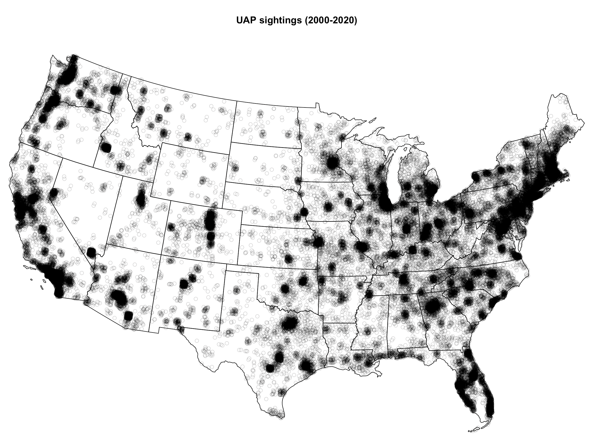
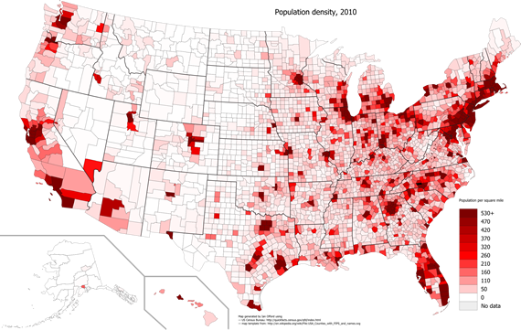

```{r setup, include=FALSE}
knitr::opts_chunk$set(echo=FALSE, warning=FALSE, message=FALSE)
options(scipen=999)

# setwd('~/nuforc_stats/notebooks/')

library(dplyr)
library(ggplot2)
library(ggResidpanel)
library(knitr)
library(lubridate)
library(stringr)
library(PerformanceAnalytics)

# load
df <- readRDS('../data/nuforc/processed/nuforc_reports.rds') %>%
  mutate(loc = tolower(paste(city, state, sep=', '))) %>%
  filter(state != 'AK', state != 'HI')

# This comes from tidycensus , I believe 2019 estimates?
cities <- read.csv('../data/census/processed/pop.csv', stringsAsFactors=FALSE)

# Places is correct for area !
places <- read.csv('../data/census/raw/2020_Gaz_place_national.tsv', sep='\t',
                   stringsAsFactors=FALSE) %>%
  janitor::clean_names() %>%
  rename(state='usps',
         city='name')

appellations <- 'CDP|city|town|municipality|borough|NA|village|government|County|county|township|corporation|comunidad|urban'
places <- places %>%
  mutate(city = str_trim(str_remove(city, appellations)))

```

# Introduction

The U.S. government has only recently began (or rather, restarted) a scientific investigation into unidentified aerial phenomena (UAP, formerly UFOs). However, there is a long tradition of attempting to study these sightings as scientifically as possible. These efforts range from official government programs, like the U.S. Air Force's Project Blue Book, to civilian organizations like the Mutual UFO Network (MUFON) or the National UFO Reporting Center (NUFORC), to privately funded programs like the National Institute for Discovery Science (NIDS).

This work has attracted the attentions of numerous highly trained experts, most often engineers, physicists, and psychologists. Statisticians, however, are rather less visible (although see Laurent, et al., 2015, and Krishnamurthy, et al., 2017). This seems odd, as several large databases of UAP sightings are maintained by numerous groups, and at considerable cost. Applying statistical methods to these data sets is likely a fruitful investment.

This paper assembles a basic statistical model that exploits a well-known feature of UAP geography. Plotting sightings on a map is perhaps the most obvious initial investigation. However, it is also the most futile. Researchers quickly discover that they have mapped little more than population density. Compare the map of UAP sightings (left) with the Census population density map (right) below---the largest cities have the largest clusters, medium cities have medium clusters, and rural areas have zero or one or two sightings. This foils any attempt to learn something non-trivial, i.e., locating particular 'hot zones' or clusters that may suggest an explanation.

```{r echo=FALSE, fig.show='hold', out.width='50%', fig.cap='Right: Plot of UAP sightings from 2000--2020 (NUFORC). Left: Plot of population density (U.S. Census). The two maps display the variable: population.'}


```

This paper attempts to get around this problem by literally removing population from the equation. Potential hot spots come into focus, suggesting novel hypotheses to be tested in the future, as well as locations best suited to hosting stationary electronic sensors. A city-level data set is collected, including the number of UAP sightings recorded in the NUFORC database, population, population density, and land area. A linear model is fit using least-squares regression. The model meets the assumptions required by linear regression, and appears to capture the data quite well. Large model errors are interpreted as indicating the presence of some effect above-and-beyond that of population. These can be considered UAP 'hot spots,' potential sites for further study.

The `R` code for this project is stored in the Github repository [benhorvath/nuforc_stats](https://github.com/benhorvath/nuforc_stats/). Contact the author at [benhorvath@gmail.com](mailto:benhorvath@gmail.com) to request the compiled data.


# Observational capacity

The simplest model of a territory's UAP observations abstracts from the particulars of time and geography. It assumes that every person in a given territory has an equal chance of observing UAP, every portion of land within the territory has an equal chance of 'manifesting' UAP, and that these probabilities do not change over time. It additionally assumes that _rates of reporting_ do not vary across populations. Although these assumptions are probably wrong, they can be provisionally accepted for the purposes of this initial work.

Comparing the maps above, it is clear that population is a major factor. All else being equal, a territory with a larger population has more people observing the sky. That is, larger cities have more _observational capacity_, a greater probability of observing and reporting aerial phenomena.

However, the land area of a territory also must be taken into account. At some point, the marginal increase of additional population drops to zero. The additional population will be 'covering' a part of the sky that is already well-observed, probably by multiple people simultaneously. There is no benefit to the extra population. This 'saturation point' depends on the land area of the territory. The larger the territory, the more population it can be accomodated before saturation. Ultimately, the more area of sky that is 'covered,' the more UAP will be reported.

This suggests a basic mathematical representation of a territory $i$'s number of UAP sightings $n$:

$$n_i = f(\mathrm{population}_i, ~ \mathrm{area}_i) + \epsilon$$
where $\epsilon$ is an error term, representing the effect of all other variables besides population and area.

The most basic form this function could take is linear and additive. These models generally represent the random variable of interest as $y$, modeled as a combination of independent variables $x_1, x_2, \ldots, x_p$ plus an error term:

$$y = \beta_0 + \beta_1 x_1 + \beta_2 x_2 + \cdots + \beta_p x_p + \epsilon$$

where $\beta_j$ represents a scalar controlling the relationship between an independent variable $x_j$ and $y$. Such a model is easily fit from empirical data via the least squares procedure, available in the statistical software `R` (R Core Team 2020). Given certain assumptions are met, statistical inferences about the fit parameters and error terms can be derived as well.


# Data

```{r, echo=FALSE}
dff <- df %>%
  mutate(city = case_when(tolower(city) == 'brooklyn' ~ 'New York City',
                                     tolower(city) == 'queens' ~ 'New York City',
                                     tolower(city) == 'staten island' ~ 'New York City',
                                     TRUE ~ city)) %>%
  mutate(madar = stringr::str_detect(text, 'MADAR')) %>%
  filter(madar == FALSE) %>%
  group_by(state, city) %>%
  summarise(n=n()) %>%
  inner_join(places, by=c('state', 'city')) %>%
  inner_join(cities, by=c('state'='state_abr', 'city')) %>%
  ungroup()
```

This project uses three main data sources. First, all UAP sightings in the continental U.S. between 2000 and 2020 were scraped from the publicly available NUFORC Database (NUFORC, Renner 2017). This totals 72,298 unique observations. The standard database entry provides an account by the witness, the date and location of the sighting, the object's shape, and the duration of sighting. The data set required some cleaning. Most notably, all boroughs of New York City, NY were reassigned to 'New York City,' and any records marked by NUFORC staff as obvious satellites have been removed (MADAR, etc.).

The U.S. Census Bureau maintains a record of the land and water area of almost all American cities (U.S. Census Bureau 2020). Although the the sightings occur over a twenty year period, areas are used as recorded in the 2020 Gazatteer files. Presumably, most cities' area has not shifted substantially.

Finally, total population and population density were retrieved from the Census's 2019 estimates. This data was pulled effortlessly via the R package `tidycensus` (Walker, et al., 2021). Again, for simplicity, it is assumed that city population and population density have not varied dramatically for most cities over the last two decades.

The combined data set contains nearly 58 thousand unique observations across more than 7700 cities, towns, and villages. This data covers 180 million Americans across all continental states, more than half of the country's total population.

The plots below show the strong correlations between most of the variables under study. The linearity of each relationship strengthens considerably on a log scale. Note that the only variables not strongly correlated with each other are land area and population density. This becomes important in the next section.

```{r, echo=FALSE, fig.show='hold', out.width='50%', fig.cap='Graphical summaries of the variables under study. Left shows the raw variables; right shows the natural log-transformed variables. The large decimals refer to the Pearson correlation between the variables, with asterisks marking statistical significance.'}
chart.Correlation(dff %>% select(n, aland_sqmi, pop, density),
                  method='pearson',
                  histogram=TRUE,
                  pch=16)

chart.Correlation(dff %>%
                    mutate(n=log(n), aland_sqmi=log(aland_sqmi), pop=log(pop), density=log(density)) %>%
                    select(n, aland_sqmi, pop, density),
                  method='pearson',
                  histogram=TRUE,
                  pch=16)
```


# Model

A linear regression model is fit on the natural logs of land area (square miles), population density (persons per square mile), and the interaction between the two. These two variables were chosen among those available because they were not highly correlated, as required by the assumptions of regression.

As always, the result do not indicate a causal relationship, only a statistical association. The full software output is below:

```{r, echo=FALSE, fig.cap='Statistical summary of the fitted model.'}
m <- lm(log(n) ~ log(density) * log(aland_sqmi), dff)

plot_resids <- resid_panel(m)

summary(m)
```

All variables, including the interaction term, are highly significant. A comprehensive analysis of the model's residuals indicates that the model meets the assumptions of linear regression (but see the appendix for more). Thus, a city's $i$'s number of UAP sightings $n$ over the period 2000--2020 (on average) can be estimated by the equation:

$$n_i = exp(-1.1885 + 0.2270~log(density_i) - 0.5077~log(area_i) +  0.1430~log(density_i)~log(area_i))$$

Interpreting the fit parameters is complicated by the model's structure. The interaction term necessarily implies that the association between density and the number of UAP observations varies according to the size of the land area, and vice versa. A graphical display communicates the model more succinctly:

```{r, echo=FALSE, fig.align='center', fig.cap='Graphical display of the fit model.'}
# Graphical demonstration
# x: 1, 1000, 2500, 4500, 6500
X1 <- data.frame(aland_sqmi=seq(0, 40, length=40),
                 density=rep(500, 40))
X1$pred <- exp(predict(m, X1))

X2 <- data.frame(aland_sqmi=seq(0, 40, length=40),
                 density=rep(1200, 40))
X2$pred <- exp(predict(m, X2))

X3 <- data.frame(aland_sqmi=seq(0, 40, length=40),
                 density=rep(2200, 40))
X3$pred <- exp(predict(m, X3))

X4 <- data.frame(aland_sqmi=seq(0, 40, length=40),
                 density=rep(3500, 40))
X4$pred <- exp(predict(m, X4))

X5 <- data.frame(aland_sqmi=seq(0, 40, length=40),
                 density=rep(5000, 40))
X5$pred <- exp(predict(m, X5))

X <- do.call(rbind, list(X1, X2, X3, X4, X5)) %>%
  mutate(density = as.factor(density))

ggplot(X, aes(x=aland_sqmi, y=pred, colour=density)) +
  geom_line() +
  labs(x='Land area (square miles)', y='Predicted UAP observations') +
  ggtitle('Graphical summary of model') +
  theme_light()
```

The plot demonstrates how both land area and population density interact to 'produce' UAP observations. Each colored line represents a different level of population density. For example, a 40 square mile territory with a density of 500 people/square mile (red line) can expect 5 observations over the relevant time span. However, a territory with only 10 square miles (yellow line) can achieve the same number of observations with a population density of 1200 persons/square mile. That is, more people covering less area increases the expected number of UAP---up to the saturation point.


# Results

This modeling exercise allows us to predict how many observations a city _should_ have, given its size and population, on average. If a city has many more than the predicted value (large error), this suggests that something else is contributing to the quantity of sightings, over-and-above the effect of its  observational capacity.

The top 25 potential hot spots suggested by the model are below. The column `n` refers to the actual number of UAP that were observed in that city from 2000--2020, and the column `pred` indicates how many were predicted by the model. The column `times` is `n` divided by `pred`, i.e., the relative size of the error.

```{r, echo=FALSE, fig.cap='Top 25 UAP hot spots.', fig.align='center'}
dff$pred <- exp(predict(m))
dff$r <- dff$n - dff$pred
dff$times <- dff$n / dff$pred

dff %>%
  select(state, city, pop, aland_sqmi, density, n, pred, times) %>%
  arrange(desc(times)) %>%
  head(25) %>%
  kable(digits=2)

export <- dff %>%
  select(state, city, pop, aland_sqmi, density, n, pred, times) %>%
  arrange(desc(times)) %>%
  mutate_if(is.numeric, round, 2)

write.csv(export, '../results/top_hotspots.csv', row.names=FALSE)
```

For example, based on its population and land area, the town of Mesquite, TX should have about zero observations. Instead it has 15, more than 53 times the model prediction! This suggests that something beyond population and area is 'producing' UAP. (Specifically, UAP observations, rather than UAP itself.)

This list is much more helpful to researchers than the raw data, which suggests that the top 25 hot spots are the 25 largest cities. It is interesting to note a large concentration around the Myrtle Beach area, which also includes North Myrtle Beach and Ocean Isle Beach. Large Florida cities with a substantial tourist industry are also well-represented, including Naples and Orlando. Oak Island, NC is another tourist destination. The exceptional quantity of observations concentrated in coastal tourist towns suggest several hypotheses to account for this. Among other, these include that: 1. People in these towns spend a disproportionate amount of time idling on a beach, and thus have more time to observe the sky; or 2. Many people are consuming alcohol and seeing things that are not there. The American southwest is also present with excess observations in Texas and Arizona towns.

However, it must be remembered this is a simple approach using a simple model. This exercise is designed as a first step, not a final step. There is no guarantee that a city is truly exceptional because it appears on this list. One potential problem is that the NUFORC entries do not include an observer ID. It is possible that one location's excessive sightings may only be a single resident is a UFO obsessive. Additionally, reporting rates probably vary by geography. Some populations may prefer to report to their sightings to a local expert rather than NUFORC (as in the Utah's Uintah Basin region; see the appendix).

The full list of 7700 cities and towns is available as a CSV on the author's Github: <https://github.com/benhorvath/nuforc_stats/blob/main/results/top_hotspots.csv>.


# Conclusion

Mapping UAP observations from large sighting databases is an obvious first move, but it is stymied by the overwhelming effect of population. This paper developed a simple linear regression model to account for this effect. By modeling a city's number of sightings as a function of land area and population density, it is possible to produce a superior list of UAP 'hot spots.' This list can be used to generate future hypotheses to test (e.g., the relationship between tourism and sightings). It can also be used to suggest placements for electronic sensor platforms (e.g.,  [Skyhub](https://skyhub.org)). Building on this model could bring us closer to a scientific explanation for the UAP mystery.


# References

* Krishnamurthy, Harish, Anna Lafontant, and Ren Yi. 2017. 'A time-series cluster space search scheme for localization of geospatial events in the UFO database.' Conference paper. Available at <https://www.researchgate.net/profile/Harish-Kashyap-2/publication/315729875_A_Time-Series_Cluster_Space_Search_Scheme_for_Localization_of_Geospatial_Events_in_the_Unidentified_Flying_Objects_UFOs_Database/links/58dfbf39aca272059aae31f6/A-Time-Series-Cluster-Space-Search-Scheme-for-Localization-of-Geospatial-Events-in-the-Unidentified-Flying-Objects-UFOs-Database.pdf>.

* Laurent, Thibault, Christine Thomas-Agnan, and Michaël Vaillant. 2015. 'Spatial point pattern analysis of the Unidentified Aerial Phenomena in France.' _arXiv_ preprint `1509.00571`. Available at <https://arxiv.org/abs/1509.00571>.

* NUFORC. National UFO Reporting Center Database. <http://www.nuforc.org/webreports.html>.

* R Core Team. 2020. _R: A Language and Environment For Statistical Computing_. R Foundation for Statistical Computing, Vienna, Austria. <https://www.R-project.org/>.

* Renner, Timothy. 2017. 'NUFORC Sighting Reports.' Github repository. <https://github.com/timothyrenner/nuforc_sightings_data/>.

* Salisbury, Frank B. 2010. _The Utah UFO Display: A Scientist's Report_. Cedar Fort.

* Walker, Kyle, Matt Herman, and Kris Eberwein. 2021. `tidycensus`. R package. <https://cran.r-project.org/web/packages/tidycensus/>.

* U.S. Census Bureau. 2020. _Gazatteer Files_. Available at <https://www.census.gov/geographies/reference-files/time-series/geo/gazetteer-files.html>. 


\appendix

# Appendix: Utah hot spots

Utah is often considered an area of concentrated UAP (Salisbury 2010). Because of this reputation, it is worth examining more closely. After accounting for area and population, the top ten Utah hot spots are:

```{r, echo=FALSE}
utah <- dff %>%
  filter(state == 'UT')

utah %>%
  select(state, city, pop, aland_sqmi, density, n, pred, times) %>%
  arrange(desc(times)) %>%
  head(10) %>%
  kable(digits=2)
```

Salt Lake City has over six times more observations than population and density would suggest. This is a substantial number, but is insufficient to make it a top hot spot.

The largest city in the Uintah Basin, Vernal, only reports 11 sightings. This is unusual because of the area's reputation for reports of bizarre phenomena. However, this may not be as puzzling as it seems. As Salisbury noted, "Incidentally, the people of the Uintah Basin didn't bother to report their sightings to the authorities," instead reporting them to a local science teacher by the name of Junior Hicks (2010, p. 28).


# Appendix: Residual analysis

The plots below show the fitted model model generally conforms to the standard assumptions of linear regression. There is no clear pattern when the predictions are plotted against the residuals, although the artifacts of only having positive numbers for $y$ are observable. There is no apparent relationship between the order of the observations, and the residuals are approximately normal with a central tendency near zero. The Q-Q plot shows some strong outliers. These are the handful of American cities with truly exceptional populations, such a New York City and Los Angeles. These large cities account for almost all of the (relatively minor) systematic errors. 

```{r, echo=FALSE, fig.align='center', fig.cap='Residual diagnostic plots.'}
plot_resids
```

```{r echo=FALSE, fig.show='hold', out.width='50%', fig.cap='Plotting residuals by longitude and latitude does not show systematic errors.'}
ggplot(dff, aes(x=intptlong, y=log(r))) +
  geom_point() +
  ggtitle('Residuals by longitude') +
  labs(x='longitude', y='residual') +
  geom_smooth(method='lm') +
  theme_light()

ggplot(dff, aes(x=intptlat, y=log(r))) +
  geom_point() +
  ggtitle('Residuals by latitude') +
  labs(x='latitude', y='residual') +
  geom_smooth(method='lm') +
  theme_light()
```

Plotting the residuals against the independent variables do show increased errors for large cities, as mentioned above. The model estimates that cities like New York City or Los Angeles should have way more sightings than they are actually do. For the most part, this is not a concern for the present project.

```{r echo=FALSE, fig.show='hold', out.width='50%', fig.cap='Plotting residuals by area and density shows a slight pattern due to large cities as outliers.'}
ggplot(dff, aes(x=log(awater_sqmi), y=log(r))) +
  geom_point() +
  ggtitle('Residuals by land area') +
  labs(x='area', y='residual') +
  geom_smooth(method='lm') +
  theme_light()

ggplot(dff, aes(x=log(density), y=log(r))) +
  geom_point() +
  ggtitle('Residuals by density') +
  labs(x='density', y='residual') +
  geom_smooth(method='lm') +
  theme_light()
```
