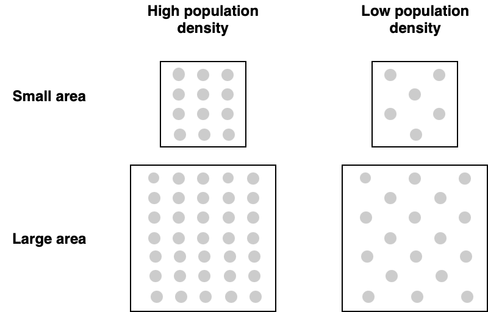

```{r setup, include=FALSE}
knitr::opts_chunk$set(echo=FALSE, warning=FALSE, message=FALSE)
options(scipen=999)

# setwd('~/nuforc_stats/paper/')

library(cowplot)
library(dplyr)
library(ggplot2)
library(ggResidpanel)
library(gridExtra)
library(knitr)
library(lme4)
library(lubridate)
library(stargazer)
library(stringr)
library(PerformanceAnalytics)
library(scales)

# TODO: In terms of sample, we are only interested in places that have at least one reported UFO sighting -- which of those is a hotspot.
# areas with no reported UFO sightings are not an interesting category for this study. Since the data set covers many small towns,
# almost all medium-sized cities, and all large cities, the prediction for any city not in this list should be 0. I did attempt a model
# including zero years for all cities listed. The effect was to reduce the constants of the model, the average, but the model parameters
# remained about the same.
```

# Introduction

A December 2017 story in the _New York Times_ revealed the existence of a secret U.S. military program studying 'advanced aerospace threats' (Cooper, Blumenthal, and Kean 2017). Concerned pilots and other military personnel reported observing strange aircraft with astounding capabilities. The Pentagon labeled these objects _unidentified aerial phenomena_ (UAP), though they are more widely known as unidentified flying objects (UFOs). These reports aroused such concern in military and political circles that Congress ordered the intelligence community to prepare a comprehensive report on UAP (ODNI 2021).

These incidents also catalyzed a number of non-governmental projects to scientifically study UAP. The Galileo Project is perhaps the most notable, consisting of team of academics assembled by the famed Harvard astronomer Avi Loeb. Its goal is to establish a network of powerful telescopes, and in conjunction with artificial intelligence, capture high resolution images of this mysterious phenomena (Loeb 2021). SkyHub, also founded in the wake of the _New York Times_ revelations, is developing their own networked instrumentation nodes (David 2021).

The success of both projects hinges on one fundamental question: Where should the instruments be placed? Worldwide networks of scientific instruments are expensive, and UAP are only rarely observed. A strategy to maximize exposure must be devised before platforms are built. One potential solution involves developing a probability model of UAP, based on existing records of past sightings. Fortunately, several civilian groups maintain large databases of sightings, often going back decades. These include the Mutual UFO Network (MUFON) and the National UFO Reporting Center (NUFORC), among others.

This solution has its own difficulties, however. Figure 1 (left) plots NUFORC sightings in the continental United States from 2000--2020. It is virtually identical to a plot of population density (right). Any possible insight is obscured by the significant association between historical UAP sightings and population. Indeed, this analysis suggests that midtown Manhattan is the optimal candidate to host instrumentation!

Rather than place instruments in areas with the most absolute sightings, we should consider areas with the most sightings _over and beyond what would be expected_, given their populations. This paper models the relationship between a territory's _observational capacity_ and its sightings using mixed effects regression. Territories with sightings well above what their population would indicate are interpreted as potential UAP hot spots, and thus candidates for further investigation as hosts of instrumentation.

```{r echo=FALSE, out.width = "100%", fig.cap='Right: Plot of UAP sightings from 2000--2020 (by author, from NUFORC database). Left: Plot of population density (U.S. Census). The two maps portray the same latent factor: population density.'}

p1 <- ggdraw() + draw_image('./img/uap_map.png')
p2 <- ggdraw() + draw_image('./img/pop_density_map.png')

grid.arrange(p1, p2, ncol=2)
```
Although no previous works take a similar approach as this paper, a number of studies have investigated the relationship between UAP sightings, population, population density, land area, etc. Plaza (2015) comprehensively reviews the historical literature. However, fifteen of seventeen studies reviewed were written in the previous century, before the popular use of information technology. Most use smaller data sets that may no longer exist, and are often limited to smaller European countries. These studies also rely on univariate analyses, calculations of averages and correlation coefficients. Finally, many of these studies were published in obscure journals and are generally unavailable to modern researchers. Laurent, et al. (2015) is the only paper using 'modern' statistical methods the author was able to locate. They are able to corroborate the long-hypothesized relationship between nuclear sites and UAP, using spatial point pattern analysis on a database of French reports. They also find a positive relationship between population density and reports.

This paper proceeds by introducing the notion of _observational capacity_ as the theoretical framework for the subsequent data analysis. The quantity of UAP observed in a territory is a function of both the territory's land area and population density. The data set collected for this project is then described. The next section introduces the linear mixed effects model, and then provides the results. The final section concludes the paper. Appendices provide analysis of the model residuals, as well as an examination of the state of Utah.


# Observational capacity

Figure 1 makes clear that population is strongly associated with UAP observations in a given territory. Intuitively, a larger population means there are more people potentially observing UAP, thus increasing the probability of reports. Conversely, a smaller population implies fewer reports.

However, the size of the territory over which the population is spread must also be considered. Higher population density may create a duplication of efforts, with multiple observers 'covering' the same portion of the sky simultaneously. This should result in increased probability of UAP reports. On the other hand, when a large area is sparsely populated, there is no chance of duplicate observation. Figure 2 illustrates each combination of population density and land area. Clearly, the large area with a dense population has the best probability of observing UAPs, while the smaller area with limited population density has the least.

However, a territory of a given size must have a _saturation point_, where any increase in population does not lead to an increase in observations. That is, any additional population observes a portion of the sky that is already 'covered' by many other observers. The additional observer does not add any additional observational capacity. The magnitude of the saturation point is directly dependent on the size of the territory. Larger territories can accommodate more population before the saturation point is reached. This implies a logarithmic relationship between population density and observed UAP. 

The exact nature of the relationship between area, population, and probability of UAP sighting can be estimated empirically via statistical modeling. However, such a model naturally makes a number of assumptions that are unlikely to hold in reality. For instance, such a model assumes that every person in a given territory has an equal chance of observing UAP. In reality, we know that this is not true: An airplane pilot has a greater chance of observation than a coal miner. The model additionally assumes that every square meter within a territory has an equal chance of 'manifesting' UAP. As research by Laurent, et al. (2015) shows, areas with certain features like a nuclear reactor or a military base seem to have a higher probability of 'attracting' UAP than others. Finally, the model assumes that rates of reporting do not vary across populations, that the percent of those who observe UAP that go on to actually file report it is constant across the United States. Despite these issues, the model appears to explain UAP observations well enough to serve as a baseline for future work.

```{r echo=FALSE, out.width = "100%", fig.cap='Illustration of population density and area, where each dot represents a unit of population. Larger area or larger density increases the probability of sighting UAP, up to a point where the marginal increase drops to zero sightings.'}

```


# Data

The National UFO Reporting Center was founded in 1974. Since then, it has collected tens of thousands of sightings. Reports were initially collected by a 24-hour telephone hotline, but can now be made via the Internet. They are processed by NUFORC staff, and then uploaded to a public website. Staff sometimes annotate reports, such as sightings of obvious man-made satellites. The standard entry provides an account of the event by the witness, the date and location, the object's shape, and the duration of sighting.

Renner (2017) provides Python code to scrape these reports from the NUFORC web site, and compile them into a central data file. The reports undergo a series of automatic cleaning and standardization, including using the free GeoLite2 geolocation database (Maxmind). Additional processing by this author includes removing records marked as obvious satellites, labeling all five boroughs of New York City as 'New York City', etc.

```{r, echo=FALSE}
# load
df <- readRDS('../data/nuforc/processed/nuforc_reports.rds') %>%
  mutate(loc = tolower(paste(city, state, sep=', ')),
         city = case_when(tolower(city) == 'brooklyn' ~ 'New York City',
                                     tolower(city) == 'queens' ~ 'New York City',
                                     tolower(city) == 'staten island' ~ 'New York City',
                                     TRUE ~ city)) %>%
  filter(state != 'AK', state != 'HI',
         year >= 2010,
         year <= 2020,
         str_detect(summary, 'MADAR') == FALSE)

# Counties
counties <- read.csv('../data/census/raw/uscities.csv', stringsAsFactors=FALSE) %>%
  select(city_ascii, state_id, county_fips, county_name, timezone) %>%
  unique()

# Add counties to reports
# County by year and county 
# This drops from 56,639 to 50,223 -- 11.3% less
df1 <- df %>%
  inner_join(counties, by=c('city'='city_ascii', 'state'='state_id')) %>%
  group_by(year, state, county_fips, county_name) %>%
  summarise(n=n())

# County area
county_area <- read.csv('../data/census/raw/county_area.csv', stringsAsFactors=FALSE, skip=2) %>%
  janitor::clean_names() %>%
  select(areaname, county_fips, land_area_sqm_2010)

# Add county area counts
# Loses only 1
df2 <- df1 %>%
  inner_join(county_area, by='county_fips')

# County population
county_pop <- read.csv('../data/census/processed/county_pop.csv', stringsAsFactors=FALSE)

# Add county population
df3 <- df2 %>%
  inner_join(county_pop, by=c('year', 'county_fips')) %>%
  select(year, state.y, state_abr, county_fips, county_name.x, n, land_area_sqm_2010,
         pop, density) %>%
  rename(state='state.y', county_name='county_name.x')

# Urbanization
urban <- read.csv('../data/census/processed/county_perc_urban.csv', stringsAsFactors=FALSE)

df4 <- df3 %>%
  left_join(urban, by=c('state_abr'='state_abr', 'county_name'='countyname')) %>%
  rename(state='state.x') %>%
  select(-state.y, -statename, -pop_cou, -county)

dff <- df4 %>%
  select(year:popden_urban) %>%
  mutate(area_cou_sqmi = area_cou * 0.00000038610215855,
         area_urban_sqmi =  area_urban * 0.00000038610215855) %>%
  select(-area_cou, -area_cou_sqmi, -area_urban) %>%
  ungroup() %>%
  na.omit
```


A total of 55,282 sighting records remain. All 48 continental states are well-represented, including nearly 10 thousand cities and towns, across 2500 counties. All large- and medium-sized cities are present. The top 10 cities are listed in table 1. Several of America's most populous cities are included. Figure 3 demonstrates substantial variation in reports over time. Reports peaked in 2014 near 7 thousand, rapidly declined to under 3 thousand in 2018, and then swing upward in the final two years of the decade.

```{r, echo=FALSE, fig.align='center'}
df %>%
  group_by(state, city) %>%
  summarise(reports=n()) %>%
  arrange(desc(reports)) %>%
  head(10) %>%
  kable(caption='Cities with most UAP reports.')
```

```{r, echo=FALSE, fig.height=2, out.width = "100%", fig.align='center', fig.cap='Total UAP reports per year.'}
df %>%
  group_by(year) %>%
  summarise(reports=n()) %>%
  ggplot(aes(x=year, y=reports / 1000)) +
    geom_line() +
    theme_minimal() +
    labs(x='year', y='reports (thousands)') +
    ggtitle('UAP reports over time') +
    scale_x_continuous(breaks = pretty_breaks())
```

Data for the explanatory variables, population and land area, were retrieved from the U.S. Census. The best and most granular data was available at the county-level. This necessitated mapping the number of UAP sightings from city- to county-level. Census indexes were essential for this conversion. The unit of analysis for the rest of this paper is thus county-year.

The Census (2021) provides yearly population and population density from 2010--2020 for every county. This data was accessed painlessly via the `tidycensus` R package (Walker, et al., 2021). The land area (square miles) of each U.S. county is available as of 2010, but not annually. However, it seems to reasonable to assume most counties' land area do not change substantially from year-to-year. 

Figure 4 shows the distributions of and relationships between each of the variables. The decimal numbers refer to the Pearson correlation between two variables. The number of asterisks indicate the statistical significance of the correlation, with more indicating a smaller $p$-value. The bottom plot shows the relationships after a logarithmic transformation of each variable. The linearity of each relationships strengthens considerably. Therefore each variable is log-transformed before modeling.

```{r, echo=FALSE, fig.show='hold', out.width='100%', fig.cap='Top: Distributions of and relationships between all variables. Bottom: Same, but log-transformed.', fig.align='center'}
chart.Correlation(dff %>% select(n:density),
                  method='pearson',
                  histogram=TRUE,
                  pch=16)

# And then logged and standardized
chart.Correlation(dff %>% select(n:density) %>% mutate_all(function(x) log(x+1)),
                  method='pearson',
                  histogram=TRUE,
                  pch=16)
```


# Model

The association between number of sightings and the independent variables is modeled using mixed effects linear regression (Gelman and Hill 2006; Galecki and Burzykowski 2013). For each individual county $i$ in year $j$, the number of UAP reports $y_{ij}$ is modeled using regression, with land areaas $x_{1i}$, and population density as $x_{2ij}$. Because of the longitudinal nature of the data, random slope effects are included for year $\gamma_j$ and for county $\alpha_i$. Both are normally distributed around zero with a standard deviation $\sigma^2$:

$$y_{ij} = \mu + \beta_1 x_{1i} + \beta_2 x_{2ij} + \beta_3 x_{1i} x_{2ij} + \alpha_i + \gamma_j + \epsilon_{i}$$
where:

* $\mu$ is the intercept term, representing overall mean number of sightings
* $\alpha_i \sim N(0,~ \sigma^2_{\alpha})$ is the 'effect' of the county $i$
* $\gamma_j \sim N(0,~ \sigma^2_{\gamma})$ is the 'effect' of the year $j$ 

The dependent variable is logged, whereas the two independent variables have been logged and standardized (omitted in the notation above for clarity's sake). Additionally, an intercept term is included, to test the possibility that the effect of population density varies depending on land area, and vice versa. Parameters are estimated to maximize the log-likelihood of the data, using R's `lmer4` package (Bates, et al., 2007). The estimated parameters are given in table 2. As always, the reader should not interpret regression results as suggesting a causal relationship, but only a statistical association. 

```{r, echo=FALSE}
dff2 <- dff %>%
  mutate(n = log(n),
         land_area_sqm_2010 = log(land_area_sqm_2010),
         pop = log(pop),
         density = log(density),
         pop_urban = log(pop_urban+1),
         poppct_urban = log(poppct_urban+0.01),
         areapct_urban = log(areapct_urban+0.01),
         popden_urban = log(popden_urban+0.01),
         area_urban_sqmi = log(area_urban_sqmi+0.01))

# Standardize
dff2_means <- dff2 %>%
  select_if(is.numeric) %>%
  colMeans %>%
  t() %>%
  as.data.frame %>%
  mutate(n = round(n),
         pop = round(pop),
         pop_urban = round(pop_urban))

dff2 <- dff2 %>%
  mutate(land_area_sqm_2010 = land_area_sqm_2010 - dff2_means$land_area_sqm_2010,
         pop = pop - dff2_means$pop,
         density = density - dff2_means$density,
         pop_urban = pop_urban - dff2_means$pop_urban,
         poppct_urban = poppct_urban - dff2_means$poppct_urban,
         areapct_urban = areapct_urban - dff2_means$areapct_urban,
         popden_urban = popden_urban - dff2_means$popden_urban,
         area_urban_sqmi = area_urban_sqmi - dff2_means$area_urban_sqmi)

dff2$county_state = paste(dff2$state, dff2$county_name, sep='_')

m2 <- lmer(n ~ land_area_sqm_2010 * density + (1 | year) + (1 |  county_state), dff2, REML=FALSE)

# stargazer(m2, title='Results', align=TRUE)
```

\begin{table}[!htbp] \centering 
  \caption{Estimated model parameters} 
  \label{} 
\begin{tabular}{@{\extracolsep{5pt}}lc}
\\[-1.8ex]\hline 
\hline \\[-1.8ex] 
 & \multicolumn{1}{c}{\textit{Dependent variable:}} \\ 
\cline{2-2} 
\\[-1.8ex] & \multicolumn{1}{c}{n} \\ 
\hline \\[-1.8ex] 
 land\_area\_sqm\_2010 & $0.558^{***}$ \\ 
  & (0.012) \\ 
  & \\ 
 density & $0.481^{***}$ \\ 
  & (0.007) \\ 
  & \\ 
 land\_area\_sqm\_2010:density & $-0.027^{***}$ \\ 
  & (0.004) \\ 
  & \\ 
 Constant & $0.783^{***}$ \\ 
  & (0.048) \\ 
  & \\ 
\hline \\[-1.8ex] 
Observations & \multicolumn{1}{c}{11,785} \\ 
Log Likelihood & \multicolumn{1}{c}{-9,823.979} \\ 
Akaike Inf. Crit. & \multicolumn{1}{c}{19,661.960} \\ 
Bayesian Inf. Crit. & \multicolumn{1}{c}{19,713.580} \\ 
Conditional $R^2$ & \multicolumn{1}{c}{0.673} \\ 
Marginal $R^2$ & \multicolumn{1}{c}{0.484} \\ 
\hline 
\hline \\[-1.8ex] 
\textit{Note:}  & \multicolumn{1}{r}{$^{*}$p$<$0.1; $^{**}$p$<$0.05; $^{***}$p$<$0.01} \\
\end{tabular} 
\end{table} 

All variables, including the interaction term, are highly significant. A comprehensive analysis of model residuals indicates that the model meets the assumptions of linear regression (but see the appendix).

The interaction term necessarily implies that the association between density and the number of UAP observations varies according to the size of the land area, and vice versa Thus a graphical display communicates the model most succinctly:

```{r, echo=FALSE, fig.align='center', fig.cap='Graphical display of fit model.', out.width='100%'}
# Must be logged and standardized -- use dff2_means
g <- expand.grid(land_area_sqm_2010=log(seq(200, 4000, length=40)) - 6.502922,
                 density=log(quantile(dff$density, c(.05, .3, .55, .8, .95))) - 5.017034 ,
                 year=0,
                 county_state='none', stringsAsFactors=FALSE)

g$pred <- exp(predict(m2, g, allow.new.levels=TRUE))

# Bring back to regular scale
g <- g %>%
  mutate(land_area_sqm_2010 = exp(land_area_sqm_2010 + 6.502922),
         density = round(exp(density + 5.017034)))

ggplot(g, aes(x=land_area_sqm_2010, y=pred, colour=as.factor(density))) +
  geom_line() +
  theme_minimal() +
  labs(x='Land area (sq. miles, 2010)', y='No. of reports', colour='Population density') +
  ggtitle('Model of annual UAP reports') +
  theme(legend.position='bottom')

# ggplot(g, aes(x=density, y=pred, colour=as.factor(land_area_sqm_2010))) +
#   geom_line() +
#   theme_minimal()
```

This plot shows how the number of annual UAP sightings in a 'generic' county varies by land area area and population density. At low population density (red), the number of sightings increases very slowly even as land area quadruples. Observational capacity does not increase quickly. In contrast, at high population density (purple), sightings increase much faster as land area increases. For all levels of population density, however, there is a point where the rate of increase of sightings declines.


# Results and discussion

The section begins by examining the random slope parameters estimated for each county $\hat{\alpha}_i$. These values represent the annual 'effect' of each particular county, over and above the effects of population and area.

Table 3 below displays the top estimates, multiplied by ten to show how many excess sightings are observed over the entire decade-long data set.

| State       | County      | Largest city | Excess sightings |
|-------------|-------------|--------------|-----------------:|
| S. Carolina | Horry       | Myrtle Beach |               54 |
| Arizona     | Maricopa    | Phoenix      |               48 |
| Washington  | King        | Seattle      |               46 |
| Idaho       | Ada         | Boise        |               39 |
| Oregon      | Multnomah   | Portland     |               35 |
| California  | San Diego   | San Diego    |               33 |
| Washington  | Snohomish   | Everett      |               33 |
| California  | Los Angeles | Los Angeles  |               33 |
| California  | Riverside   | Riverside    |               30 |
| Washington  | Clark       | Vancouver    |               30 |

Table: Excess sightings by county.

Even allowing for these adjustments, some counties record far higher sightings than expected. For instance, Maricopa county has 1137 sightings, whereas the model predicts only 784. For the most part, the excess is attributable to handful of years only. In Maricopa's case, these are the years 2014--15, the global peak of sightings. The table 4 below shows the largest model errors at the unit-level. For the most part, they are clustered around this peak, with Horry and Maricopa counties dominating the list.

\pagebreak

```{r}
dff$pred <- exp(predict(m2))

dff %>%
  mutate(error = n - pred) %>%
  select(year, state, county_name, n, pred, error) %>%
  arrange(desc(error)) %>%
  head(10) %>%
  kable(digits=0, caption='Largest model errors, by year-county.')

# dff %>%
#   select(state, county_name, year, n, pred) %>%
#   filter(state == 'Arizona', county_name == 'Maricopa') %>%
#   View
```

Previous work have tried to 'control for' the effects of population by putting sightings into a per capita number (described in Plaza 2015). This calculation is duplicated below in table 5. The top ten list is substantially different than what is given by the mixed effects model; only Horry county is shared between them. Simply dividing by population does not fully account for effects of population. Additionally, it is less practically useful---it does not make sense to place expensive instrumentation in a territory that sees less than one sighting per year!

```{r}
dff %>%
  group_by(state, county_name) %>%
  summarise(mean_pop = mean(pop),
            n = sum(n)) %>%
  mutate(per_capita_year = (n / 10) / mean_pop) %>%
  arrange(desc(per_capita_year)) %>%
  head(10) %>%
  kable(digits=0, caption='Top counties by per capita UAP reports. This ordering is substantially different compared to the model, and less practically useful.')
```

The mixed effects model helps us to 'look past' the effects of population and land area, to more clearly identify unusually active areas. However, it does not explain _why_ these areas are especially active. The model identifies areas worthy of additional study only. For instance, a county may have an unusual number of sightings because a single resident is a UFO obsessive, relentlessly reporting every object in the sky. The NUFROC database entries do not offer an anonymized user ID that would help identify such entries. Additionally, a city may have an active UFO group, creating a higher reporting rate than other locations. The locale's culture around UAP may also influence the number of reports. This may be the case with the most anomalous city identified by the model, Myrtle Beach. At one point, Myrtle Beach hosted a UFO/alien museum called Encounters: UFO Experience, very close to the beach (TripAdvisor). This may have put visitors into the mindset where they are more likely to identify common sights as anomalous, then seek out a venue to report them.

Given the stereotypical UFO experience occurs in a remote region, far from large concentrations of people, it may seem odd that reports should be positively associated with population. Indeed, computer scientist Jacques Valleé has gone so far as to promulgate a 'law': UFO landings are inversely correlated with population density (Valleé 1966). However, the vast majority of records in the NUFROC data concern _sightings in the sky_, and not landings or so-called 'high strangeness.' Plaza (2015) shows that there is no contradiction between this 'law' and the model fit above. Indeed, this paper largely supports Plaza's findings.


# Conclusion

Mapping UAP observations from large sightings databases may seem like a promising way to begin investigation, but it is stymied by the overwhelming effect of population. This paper developed a simple mixed effects regression model to account for this effect. By modeling a county's number of sightings as a function of land area and population density, it is possible to produce a superior list of potential UAP 'hot spots.' Among the leading hot spots include Myrtle Beach (SC), Phoenix (AR), and Seattle (WA). This list can be used to generate future hypotheses to test. It may also suggest optimal placements for electronic sensor platforms. Additional work extending this model may bring us closer to a scientific explanation for the UAP mystery.


\pagebreak

# Appendix: Model diagnostics

Model residuals are normally distributed, including those for the random effects of year and county. Collinearity is not an issue. It does appear that county-years with only a few sightings, and county-years with many sightings, have a mean residual greater than zero. This indicates the model  has higher rates for low population areas with few sightings, as well very large territories. The latter represent the 'excess sightings' this paper has tried to identify. Residuals do not appear to vary with either of the independent variables. Random slopes are confirmed as approximately normally distributed.

```{r, echo=FALSE, out.width = "100%", fig.align='center', fig.cap='Diagnostics of model show the model mostly meets the conditions for valid inference.'}
diagnostic <- dff2 %>%
  mutate(fitted = predict(m2),
         resid = resid(m2))

diag1 <- ggplot(diagnostic, aes(x = fitted, y = resid)) +
  geom_point() +
  geom_smooth() +
  theme_minimal() +
  ggtitle('Residual linearity') +
  labs(x='Fitted', y='Residuals') +
  geom_hline(yintercept=0)

# Normality of residuals
diag2 <- ggplot(diagnostic, aes(x = resid)) +
  geom_density(fill='gray', alpha=0.5) +
  theme_minimal() +
  ggtitle('Residual normality') +
  labs(x='Residuals') +
  geom_hline(yintercept=0)

# QQnorm
diag3 <- ggplot(diagnostic) + 
  stat_qq(aes(sample=resid), alpha=0.3) +
  stat_qq_line(aes(sample=resid)) +
  theme_minimal() +
  ggtitle('Residuals QQ plot') +
  labs(x='Theoretical quantiles', y='Sample quantiles')

# Colinnearity
vif <- performance::check_collinearity(m2)
vif_df <- data.frame(term=c('area', 'density', 'interaction'), vif=vif$VIF)
diag4 <- ggplot(vif_df, aes(x=term, y=vif)) +
  geom_col() +
  ylim(0, 10) +
  geom_hline(yintercept=5, colour='red', linetype = 'dashed') +
  theme_minimal() +
  ggtitle('Collinearity') +
  labs(x='Term', y='VIF')

grid.arrange(diag1, diag2, diag3, diag4, nrow=2)
```

\pagebreak


# Appendix: Utah

Utah is often considered an area of concentrated UAP (Salisbury 2010). Because of this reputation, it is worth examining more closely. After accounting for area and population, the top Utah hot spots are:

```{r, echo=FALSE, fig.align='center'}
dff %>%
  filter(state == 'Utah') %>%
  group_by(state, county_name) %>%
  summarise(n=sum(n),
            pred=sum(pred)) %>%
  arrange(desc(n)) %>%
  head(11) %>%
  mutate(excess = pred - n) %>%
  kable(digits=0, caption='Utah counties with highest number of sightings.')
```

Salt Lake City clearly dominates the list as Utah's greatest hot spot, even after accounting for population and area. Utah county also manifests excessive UAP, although the rest of Utah appears to be in line with expectations.

Uintah county, a notable hot spot, has the eleventh-most sightings in Utah. Its nine reported sightings from 2010--2020 perfectly matches the model's predictions. This is unusual because of the area’s reputation for reports of bizarre phenomena. However, this may not be as puzzling as it seems. As Salisbury noted, 'Incidentally, the people of the Uintah Basin didn't bother to report their sightings to the authorities,' instead reporting them to a local science teacher by the name of Junior Hicks (2010, 28).

\pagebreak


# References

\setlength{\parindent}{-0.25in}
\setlength{\leftskip}{0.25in}
\setlength{\parskip}{6pt}

Bates, Douglas, Martin Maechler, Ben Bolker, et al. 2007. 'The `lme4` package.' R package.

Cooper, Helene, Ralph Blumenthal, and Leslie Kean. 2017. "Glowing auras and 'black money': The Pentagon's mysterious UFO program." _New York Times_, Dec. 16.

David, Leonard. 2021. 'Spotting UFOs: Do-it-yourself sky surveillance comes online.' _Space.com_, March 3. <`https://www.space.com/spotting-ufos-sky-` `hub-surveillance`>.

Gałecki, Andrzej, and Tomasz Burzykowski. 2013. _Linear Mixed-Effects Models Using R: A Step-By-Step Approach_ (Springer).

Gelman, Andrew, and Jennifer Hill. 2006. _Data Analysis Using Regression and Multilevel/Hierarchical Models_ (Cambridge University Press).

Laurent, Thibault, Christine Thomas-Agnan, and Michaël Vaillant. 2015. 'Spatial point pattern analysis of the Unidentified Aerial Phenomena in France.' _arXiv_ preprint `1509.00571`.

Loeb, Avi. 2021. 'Announcing a new plan for solving the mystery of unidentified aeriel phenomena.' _Scientific American_, July 26.  
<`https://www.scientificamerican.com/article/announcing-a-new-plan-` `for-solving-the-mystery-of-unidentified-aerial-phenomena/`>.

Maxmind. Geolite2 geolocation database. <`https://dev.maxmind.com/geoip/` `geolite2-free-geolocation-data`>.

ODNI (Office of the Director of National Intelligence). 2021. 'Preliminary Assessment: Unidentified Aerial Phenomena.' June 25. <`https://www.dni.gov/` `files/ODNI/documents/assessments/Prelimary-Assessment-UAP-` `20210625.pdf`>.

Plaza, Julio. 2015. 'A review on the relation between population density and UFO sightings.' _Journal of Scientific Exploration_ 29, no. 3: 425--48.

R Core Team. 2020. R: A Language and Environment For Statistical Computing. R Foundation for Statistical Computing, Vienna, Austria.  
<`https://www.R-project.org/`>.

Renner, Timothy. 2017. 'NUFORC Sighting Reports.' Github repository. <`https://github.com/timothyrenner/nuforc_sightings_data/`>.

Salisbury, Frank B. 2010. _The Utah UFO Display: A Scientist's Report_ (Cedar Fort).

TripAdvisor. 'Things to do in Myrtle Beach: Encounters UFO Experience.' <`https://www.tripadvisor.com/Attraction_Review-g54359-d4145792-`  
`Reviews-Encounters_UFO_Experience-Myrtle_Beach_South_Carolina.html`>.

U.S. Census Bureau. 2011. Land area: Excel file `LND01.xls`. _Statistical Abstract of the United States_. Available at  <`https://www.census.gov/library/` `publications/2011/compendia/usa-counties-2011.html`>.

U.S. Census Bureau. 2020. Gazatteer Files. Available at 
<`https://www. census.gov/geographies/reference-files/time-series/geo/gazetteer-` `files.html`>.

Valleé, Jacques. 1966. 'The patterns behind the UFO landings.' _Flying Saucer Review_ no. 1: 8--27. Available at <`http://www.ignaciodarnaude.com/ufologia/` `Vallee,Pattern%20behind%20UFO%20landings,FSR-SI%201966%20N%201,` `Humanoids.pdf`>.

Walker, Kyle, Matt Herman, and Kris Eberwein. 2021. `tidycensus`. R package. <`https://cran.r-project.org/web/packages/tidycensus/`>.
